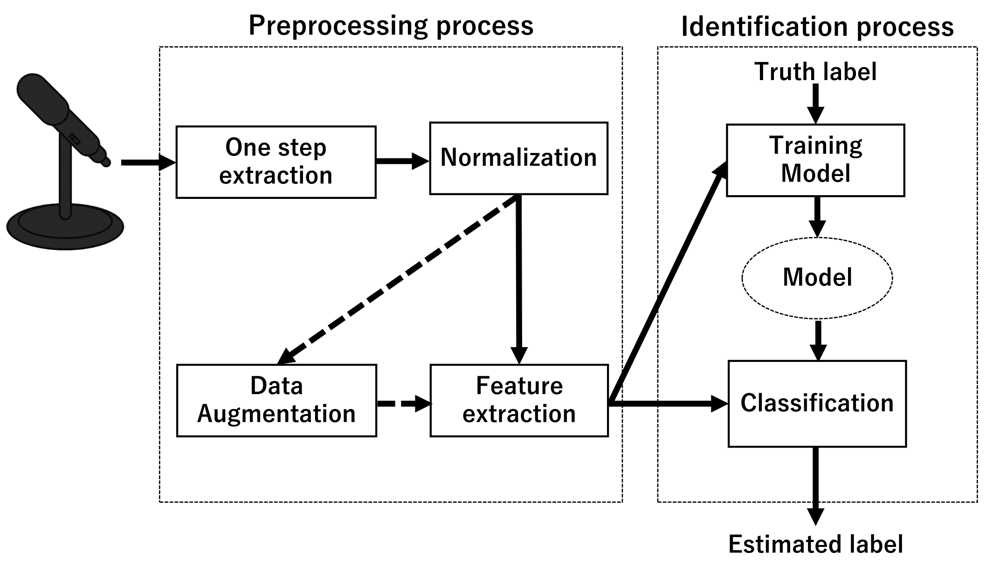

# 足音を用いた個人認識に関する研究の資料




## 手順要約
1. 好きなフォルダに録音したデータを保存
1. cutlen.pyで１歩分の切り出し
1. augment.pyでData augmentation
1. 各種手法を用いて学習(hoge_train.py)
1. 切り分けていたテストデータを使って評価(hoge_eval.py)

### - データを保存
フォルダを作成し，その中にtestとtrainを切り分けて保存する  
また，音源があるファイルの一つ上のフォルダはsubject毎にフォルダを作る  
例としてファイル構成は以下

data/  
&nbsp;&nbsp;├ test  
&nbsp;&nbsp;&nbsp;&nbsp;&nbsp;&nbsp;├ subject1  
&nbsp;&nbsp;&nbsp;&nbsp;&nbsp;&nbsp;&nbsp;&nbsp;&nbsp;└ hogehoge.wav  
&nbsp;&nbsp;&nbsp;&nbsp;&nbsp;&nbsp;├ subject2  
&nbsp;&nbsp;&nbsp;&nbsp;&nbsp;&nbsp;&nbsp;&nbsp;&nbsp;└ hogehoge.wav  
&nbsp;&nbsp;├ train  
&nbsp;&nbsp;&nbsp;&nbsp;&nbsp;&nbsp;├ subject1  
&nbsp;&nbsp;&nbsp;&nbsp;&nbsp;&nbsp;&nbsp;&nbsp;&nbsp;└ hogehoge.wav  
&nbsp;&nbsp;&nbsp;&nbsp;&nbsp;&nbsp;├ subject2  
&nbsp;&nbsp;&nbsp;&nbsp;&nbsp;&nbsp;&nbsp;&nbsp;&nbsp;└ hogehoge.wav  
  
### - １歩分切り出し

```Terminal:Terminal
python cutlen.py --wavdir ./data/train
```
これで自動的に生成する  
  
### - npz化・Data augmentationの実行

```Terminal:Terminal
python augment.py --wavdir ./data/train/split
```
前の処理でsplitフォルダが出来ているはず  
splitフォルダには各個人の抽出済みの足音音声が保存されているので，それを参照する  
これで，splitフォルダの中に以下のデータが保存される  
(ここで，前回保存したnpzファイルがある場合上書きされずにpassされる為注意)

- esc_melsp_test.npz  
-- validation用のデータ
- nesc_melsp_train_raw.npz  
-- 元のtraining用のデータ
- esc_melsp_train_wn.npz
-- white noizeを混ぜたaugmentationデータ
- esc_melsp_train_ss.npz  
-- time shiftを行なったaugmentationデータ
- esc_melsp_train_st.npz  
-- time stretchingを行なったaugmentationデータ
- esc_melsp_train_com.npz  
-- 強度の違うwhite noizeを混ぜたデータに，ランダムでSS or STを更に行なったaugmentationデータ

### - 各データの移動
以後の動作でわかりやすくする為に，以下を実行  
(カレントディレクトリは.pyファイルがある場所)
- train内のkutusitaとslip内にあるsplitフォルダを"./data/kutusita/"と"data/slip/"に移動する  
- 同様に，test内のkutusitaとslip内にあるsplitフォルダを"./testdata/kutusita/"と"testdata/slip/"に移動する

また，上記で生成したnpzファイルを以下にそれぞれ移動
- ./slip_npzdata/
- ./kutusita_npzdata/

### - 各モデルでの学習
今回検討する手法は以下の3つ  
詳しい情報は論文を参照のこと

- CNNを用いた手法
- SVMを用いた手法
- NMF+SVMを用いた手法

それぞれのモデルを学習させる(これはcnnをaugmentationあり，靴下の音で学習させる場合)  
この時，それぞれに対応するモデルを保存する為のディレクトリを作成しなければならない

```Terminal:Terminal
python cnn_train.py --aug yes --type kutusita_npz_data/
```

### - 各モデルでの評価
それぞれのモデルを個別に評価するときは以下を実行
```Terminal:Terminal
python cnn_eval.py --wavdir ./data --testdir ./testdata --aug yes --type kutusita
```
```Terminal:Terminal
python svm_eval.py --wavdir ./data --testdir ./testdata --aug yes --type kutusita --nmf yes
```
また，一気に評価をしてその結果を表形式で書き出したいときは以下を実行
```Terminal:Terminal
python eval_allmodels.py --wavdir ./data --testdir ./testdata --type kutusita
```

### - 各モデルのデータについて

[一応ここにも置いてあります](https://drive.google.com/drive/u/1/folders/1jFc9k5Jfd7vSwG2d6iXW9vnjmMzTCdf_)

